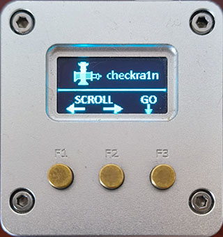

[English](./README_EN.md)

NaonPi NEO(2)越狱盒子
====

* Palera1n功能菜单

> 支持IOS15-16.x系统，[palera1n官网](https://palera.in)。盒子版本为：v2.0.0 beta 7

> 功能菜单：Rootless(无根越狱)--Rootfull(有根越狱)--Exit Recovery(退出恢复模式)--Exit(退出返回主菜单)

> 子菜单：Options(选项设置)--Start(开始越狱)--Back(返回上一级)

> 有根越狱子菜单：Create FakeFs(首次完全越狱（支持32G及以上手机)--Create BindFS(16G首次越狱必须选这个)--Safe Mode(越狱进入安全模式)--Restore RootFs(清除越狱)

>（显示星号为选定）按最右边按键可改变选定状态，以上四处选项只能选择一个。首次越狱后，引导开机无须选择，直接开始即可。

* Checkra1n功能菜单

> 支持IOS12-14.x,[checkra1n官网](https://checkra.in)。盒子版本为:0.12.4

> 功能菜单：Options(设置)--Run Checkran(开始越狱)--Stop Checkra1n(关闭越狱进程)--Exit(返回主菜单)

> 子菜单设置：Safe Mode(安全模式)--Revert(清除越狱) 有星号时为选定，正常越狱无须设置。

* ReBoot(用于重启盒子)

* 其它功能

> 当在主菜单，盒子无操作超过30秒自动息屏。(如需改动请修改memu.py中outtime值)

> 在息屏状态时，按任意键或者连接入有效手机时自动唤醒屏幕。

> 越狱完成时，自动返回主菜单。

## 越狱盒子制作
 
1.下载Armbian固件 - 下载 Jammy 版本
>   [NanoPi Neo](https://k-space.ee.armbian.com/oldarchive/nanopineo/archive/Armbian_23.8.1_Nanopineo_jammy_current_6.1.47.img.xz)
>   [NanoPi Neo2](https://k-space.ee.armbian.com/oldarchive/nanopineo2/archive/Armbian_23.8.1_Nanopineo2_jammy_current_6.1.47.img.xz)

2.下载tf卡写卡工具Etcher

>   [Etcher](https://etcher.balena.io/)

3.ssh连接上nanoPI:

    固件包默认密码： 1234, 提示修改密码时，修改为： lazybot
    提示新建用户时，新建用户名：lazybot 密码：lazybot
    ssh界面提示:
        Create root password: lazybot
        Repeat root password: lazybot
        Choose default system command shell: 1 (bash)
        Please provide a username (eg. your first name):lazybot
        Create user (lazybot) password:lazybot
        Repeat user (lazybot) password:lazybot
        Please provide your real name: Lazybot : ENter
        Set user language based on your location? [Y/n]Y
        At your location, more locales are possible: 1 

4.复制下面代码运行

    sudo apt-get update
    sudo apt-get install -y git
    git clone https://github.com/lazybot2/palera1nbox.git
    cd palera1nbox
    sudo chmod +x ./install.sh
    sudo ./install.sh

-   选择对应盒子对应数字：0 或 1

>>   0.NanoPi NEO

>>   1.NanoPi NEO2

5.设置盒子i2c0

    sudo armbian-config
    Menu System > Hardware > enable i2c0
    Save and reboot

## 使用制作好的懒人包

	1.下载NanoPi Neo懒人包 
   -  [谷歌](https://drive.google.com/drive/folders/1dJ0MHaLiGA3qyHK-HXtDJz3COD-yDQUt?usp=sharing)
   -  [百度](https://pan.baidu.com/s/1v_ai5yPQtnU9-sPLJFLSgg?pwd=pale)提取码:pale

    2.用写卡工具写入tf卡，直接装机运行即可。

## 视频

- [抖音](https://v.douyin.com/iL9188Md/)

## 捐贈

如果你觉得此项目对你有帮助，可以捐助我们，加以鼓励。感谢！

### 支付宝

### 微信

### PayPal

