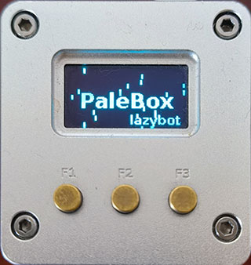
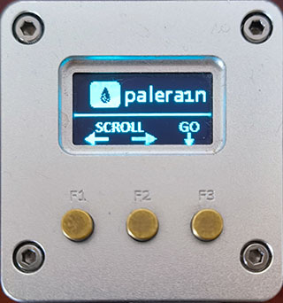
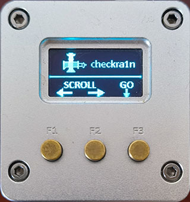
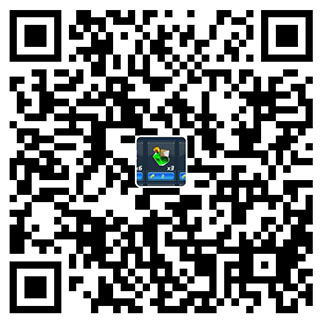

## palera1n & checkra1n for NaonPi NEO(2)
---

## Installation instructions
---    

1.Download Armbian - Armbian Jammy
-   [NanoPi Neo](https://www.armbian.com/nanopi-neo/)
   
-   [NanoPi Neo2](https://www.armbian.com/nanopi-neo-2/)

2.Balena Etcher for burning the SD card

-   [Etcher](https://etcher.balena.io/)

3.SSH Connection

    Log in in with username root and default password 1234, after logging in change the password to lazybot

    When being asked to provide a username after changing the default root password, please enter lazybot as username and lazybot as password.

    Tip:
        Create root password: lazybot
        Repeat root password: lazybot
        Choose default system command shell: 1 (bash)
        Please provide a username (eg. your first name):lazybot
        Create user (lazybot) password:lazybot
        Repeat user (lazybot) password:lazybot
        Please provide your real name: Lazybot : ENter
        Set user language based on your location? [Y/n]Y
        At your location, more locales are possible: 1 

4.install

    git clone https://github.com/lazybot2/palera1nbox.git
    cd palera1nbox
    sudo chmod +x ./install.sh
    sudo ./install.sh

-   select NanoPi：0 或 1

-   0.NanoPi NEO
-   1.NanoPi NEO2

5.Turn on I2C module loading

    sudo armbian-config

    Menu System > Hardware > enable i2c0

    Save and reboot

other:

	1.Download palera1nbox img for NEO
   -  [google](https://drive.google.com/drive/folders/1dJ0MHaLiGA3qyHK-HXtDJz3COD-yDQUt?usp=sharing)
   -  [baidu](https://pan.baidu.com/s/1f2OXmuxMFKDYLtpCGV_NSw)提取码:pale

	2.Etcher To SD card

## [Youtube](https://www.youtube.com/playlist?list=PLv2ojzLXyelMOqk1nPhixQuGTWQnM8f3E)

## Donation

If this project does help you, please consider donating to support the development of this project.

### Alipay

### Wechat

### PayPal

